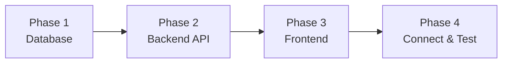
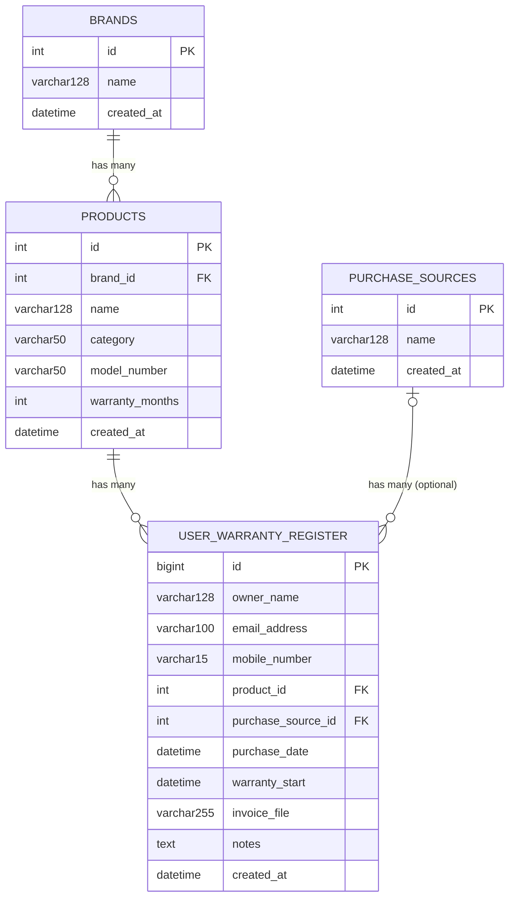

# Beginner's Requirement & Build Guide
## How to build a Multi-Brand Electronics Warranty Registration Portal, step by step

**Audience:** someone new to full-stack development who wants to build this project alone, one layer at a time.
**Companion document:** [Requirements_Guide.md](Requirements_Guide.md) states *what* the finished system must do, without prescribing implementation steps — read that first if you want to plan your own design before following this walkthrough. [Software_Requirements_Specification.md](Software_Requirements_Specification.md) documents one existing implementation for technical reference (note: that implementation was narrowed to a single solar-products brand — read it as one example, not the target scope for this guide).

---

## 1. What you're building

You're building a warranty registration portal for a company that sells or services electronics from **many different brands and product categories** — televisions, refrigerators, washing machines, air conditioners, mobile phones, laptops, microwaves, and more — not just one product line. Customers should be able to:

1. **Register a product they just bought** (owner details, which brand/product, purchase date, and a photo/PDF of their invoice).
2. **Check the warranty status of anything they've previously registered**, across every brand and category, just by entering their mobile number.

That's the whole product. No logins, no admin panel — just two forms and a results page, backed by a small API and a database. The key design challenge, compared to a single-brand app, is that the **product catalog itself is multi-dimensional** (brand × category × model), so your data model and UI need to handle that from day one rather than assuming one fixed product list.

**Important: this is not a SaaS app.** You're building a **single-tenant** application — one deployment, run by one company, with one shared catalog. There's no login, no per-customer account, no multi-company data isolation to build. The reason to keep brand/category as *data* (rows in a table) instead of *hardcoded values* (enum, if/else branches, baked-in seed data your code depends on) isn't to serve multiple companies at once — it's so that **a different company could adopt this exact codebase later** just by deleting the seed data and loading their own brands/products/purchase sources, without touching a single line of code. Keep that test in mind throughout: "if someone deleted all my seed data and loaded a completely different company's catalog, would my code still work unmodified?"

### 1.1 Prerequisites

Before starting, you should be comfortable with:
- Basic C# (classes, properties)
- Basic JavaScript/TypeScript (functions, `async/await`)
- Basic SQL concepts (tables, primary keys, foreign keys)

Install these tools first:
| Tool | Purpose |
|---|---|
| [.NET SDK 10](https://dotnet.microsoft.com/download) | runs the backend |
| [Node.js 20+](https://nodejs.org/) | runs the frontend build tools |
| MySQL Server (or [MySQL via Docker](https://hub.docker.com/_/mysql)) | the database |
| VS Code (with C# Dev Kit) or Visual Studio | code editor |
| A REST client (Scalar UI, which comes free with the project, or Postman) | to test the API without a frontend |

### 1.2 The build order — why this sequence

Build **bottom-up**: database → backend → frontend. Each layer depends on the one before it, so building in this order means you can always test what you just built before moving on.



| Phase | What you produce | How you verify it works |
|---|---|---|
| 1. Database | Tables + sample data | Run SQL queries directly in MySQL |
| 2. Backend | A REST API | Call endpoints with Scalar UI / curl — no frontend needed yet |
| 3. Frontend | Pages that call the API | Click through the app in a browser |
| 4. Integration | The two talking to each other in one deployable app | Full end-to-end user journeys |

---

## 2. Phase 1 — Database Design

### 2.1 Concepts you need first
- A **table** stores one kind of "thing" (a brand, a product, a registration).
- A **primary key (PK)** uniquely identifies each row (usually an auto-incrementing `id`).
- A **foreign key (FK)** is a column that points to another table's primary key, creating a relationship (e.g., "this product belongs to this brand").
- **1-to-many**: one brand can have many products, but each product belongs to exactly one brand.

### 2.2 Design the schema

You need four tables. Draw this out before writing any SQL — it forces you to think about relationships first. Notice `brands` is new compared to a single-company app: it's what makes the catalog multi-manufacturer instead of one fixed product list.



### 2.3 Feature: Brand Catalog table

**Use case:** *As the platform operator, I want to track multiple manufacturers/brands in one system, so a customer can register their TV from one brand and their refrigerator from a completely different brand through the same portal.*

**Steps:**
1. Create a `brands` table: `id`, `name`, `created_at`.
2. Insert a handful of seed rows — invent a few brand names covering different product lines (e.g., a brand known for TVs/mobiles, a brand known for appliances, a brand known for laptops), so your catalog isn't accidentally single-purpose.

**How to verify:** `SELECT * FROM brands;` returns your seeded rows.

### 2.4 Feature: Product Catalog table

**Use case:** *As a customer, I need to select the exact product I bought — a specific model, from a specific brand, in a specific category — and the system needs to know how long that specific product is covered for, since warranty length varies enormously (a TV might carry 1–2 years; a large appliance might carry far longer) and can vary even within the same brand.*

**Steps:**
1. Create a `products` table with a **required foreign key** `brand_id → brands.id`, plus `name`, `category`, an optional `model_number`, and `warranty_months`.
2. `category` should be a plain text/short-code field (Television, Refrigerator, Washing Machine, Air Conditioner, Mobile Phone, Laptop, Microwave Oven, etc.) — don't hardcode a fixed list in your application code, since new categories should be addable just by inserting data.
3. `warranty_months` is the key field — it's how long (in months) that specific product model is covered. This is why warranty length lives on the *product*, not as one global number, and not even as one number per category (two different brands' refrigerators can have different warranty lengths).
4. Insert seed rows spanning at least 3–4 different categories and at least 2–3 different brands, so you have realistic variety to test against later — this is what will force your queries and UI to handle "many brands, many categories" instead of silently assuming one.

**How to verify:** `SELECT p.*, b.name AS brand_name FROM products p JOIN brands b ON p.brand_id = b.id;` should show each product with its correct brand.

### 2.5 Feature: Purchase Source table

**Use case:** *As the platform operator, I want to know where a customer bought their product (our store, a dealer, a marketplace like Amazon), so we can track sales channels — but I don't want to force the customer to pick one if they're not sure, and the same source can sell products from many different brands.*

**Steps:**
1. Create a `purchase_sources` table (just `id`, `name`, `created_at`).
2. Seed it with a handful of sources.
3. Note this table is **optional** from the registration's point of view, and has no relationship to `brands` — design the foreign key on registrations to allow `NULL`.

**How to verify:** `SELECT * FROM purchase_sources;`

### 2.6 Feature: Warranty Registration table

**Use case:** *As a customer, I want my registration (who I am, what I bought, when, and proof of purchase) saved permanently, so I — or support staff — can look it up later, regardless of which brand or category the product belongs to.*

**Steps:**
1. Create `user_warranty_register` with the columns above.
2. Add a required foreign key `product_id → products.id` (every registration must reference a real product; brand and category are implied through this link, not duplicated onto the registration).
3. Add an optional foreign key `purchase_source_id → purchase_sources.id` (nullable).
4. `mobile_number` is important: it's not a foreign key, but it's the field customers will later search by, so treat it as a lookup key even though there's no separate "customers" table.
5. `invoice_file` just stores a file *path* (text) — the actual file itself will live on disk, not in the database (you'll build that in Phase 2).
6. Notice there's **no `warranty_end` or `status` column**. That's intentional — warranty end date and status ("Active"/"Expiring Soon"/"Expired") change every single day just by the calendar moving forward, so instead of storing a value that goes stale, you'll *calculate* it on demand in later phases (`warranty_start + product.warranty_months`), which works identically whether the warranty is 12 months or 300 months.

**How to verify:** manually `INSERT` two test rows referencing products from two *different* brands, then `SELECT` them back with a `JOIN` through `products` to `brands` to confirm both relationships work together.

### 2.7 Phase 1 checklist
- [ ] `brands` table created and seeded with more than one brand
- [ ] `products` table created and seeded, referencing multiple brands and multiple categories
- [ ] `purchase_sources` table created and seeded
- [ ] `user_warranty_register` table created with both foreign keys
- [ ] You can manually insert registrations for products from different brands and join them all the way through to brand name

---

## 3. Phase 2 — Backend API (ASP.NET Core Web API)

### 3.1 Concepts you need first
- A **Web API** exposes URLs (endpoints) that return data (usually JSON) instead of HTML pages.
- **EF Core** (Entity Framework Core) lets you write C# classes that map to database tables, and query them with C# instead of raw SQL.
- A **Controller** groups related endpoints together (e.g., everything about products goes in `ProductsController`).
- **DTO** (Data Transfer Object) is a plain class that shapes exactly what a request/response looks like — it's not always identical to your database model.

### 3.2 Step: Project setup
1. Create a new ASP.NET Core Web API project.
2. Add NuGet packages: `Microsoft.EntityFrameworkCore`, `Pomelo.EntityFrameworkCore.MySql` (this is the MySQL driver for EF Core).
3. Add your MySQL connection string to `appsettings.json` under `ConnectionStrings:DefaultConnection`.
   > ⚠️ Beginner trap: never commit a real password in `appsettings.json` to source control. Use `dotnet user-secrets` locally, or an environment variable, from day one — it's much harder to fix later.
4. In `Program.cs`, register the database context: `builder.Services.AddDbContext<AppDbContext>(...)`.
5. Optional but recommended: add `Scalar.AspNetCore` for a free, browsable API testing UI at `/scalar/v1` — this replaces needing Postman for quick manual testing.

### 3.3 Step: Models (map C# classes to your tables)
Create one class per table, matching the columns you designed in Phase 1:

```csharp
public class Brand
{
    public int Id { get; set; }
    public string Name { get; set; }
    public DateTime CreatedAt { get; set; }

    // Navigation: one brand has many products
    public ICollection<Product> Products { get; set; }
}

public class Product
{
    public int Id { get; set; }
    public int BrandId { get; set; }
    public string Name { get; set; }
    public string Category { get; set; }
    public string? ModelNumber { get; set; }
    public int WarrantyMonths { get; set; }
    public DateTime CreatedAt { get; set; }

    // Navigation
    public Brand Brand { get; set; }
    public ICollection<UserWarrantyRegister> WarrantyRegistrations { get; set; }
}
```

Do the same for `PurchaseSource` and `UserWarrantyRegister` (the latter needs `ProductId`/`Product` and nullable `PurchaseSourceId`/`PurchaseSource` navigation properties). Use `[Table("products")]` and `[Column("name")]` attributes if your C# naming (PascalCase) differs from your SQL naming (snake_case).

### 3.4 Step: DbContext
Create a class that inherits `DbContext` with one `DbSet<T>` per table — this is the object EF Core uses to actually talk to the database.

**How to verify Phase 2 setup so far:** run the app; if it starts without a connection error, EF Core successfully connected to MySQL.

### 3.5 Feature: List Brands API

**Use case:** *As a customer filling out the registration form, I may want to narrow the product list down by brand first — especially once the catalog spans many manufacturers.*

**Endpoint to build:** `GET /api/Brands` (list all) and `GET /api/Brands/{id}` (single, 404 if not found).

**How to verify:** open Scalar UI, call `GET /api/Brands`, confirm you get back your seeded brands.

### 3.6 Feature: List Products API

**Use case:** *As a customer, I need to see the product catalog — across all brands and categories — so I can pick the exact item I bought.*

**Endpoint to build:** `GET /api/Products`

**Steps:**
1. Create `ProductsController` with a constructor that injects your `DbContext`.
2. Add a `[HttpGet]` action that queries all products (consider including the brand name in the response, via `.Include(p => p.Brand)`, so the frontend doesn't need a second call just to show it) and returns them as JSON.
3. Also build `GET /api/Products/{id}` (single product, 404 if not found) and `GET /api/Products/search?name=...` (substring search — used by a searchable dropdown later). Consider whether `search` should also accept an optional `brandId` or `category` filter, since a flat list becomes unwieldy once you have many brands.

**How to verify:** call `GET /api/Products`, confirm each product includes correct brand info, and that products span more than one brand and category in your seed data.

### 3.7 Feature: List Purchase Sources API

**Use case:** *As a customer, I want to optionally tell the system where I bought the product, from a short dropdown list, without being forced to type free text.*

**Endpoint to build:** `GET /api/PurchaseSources` and `GET /api/PurchaseSources/{id}`. Same pattern as brands, just simpler (no category/warranty fields).

### 3.8 Feature: Register a Warranty (the core feature)

**Use case:** *As a customer, I want to submit my name, mobile number, the product I bought (whatever brand/category it is), when I bought it, and a photo of my invoice, and have the system confirm my product is now covered until a specific date.*

This is the most complex endpoint — build it in small pieces and test after each one.

**Endpoint to build:** `POST /api/WarrantyRegistrations` (accepts `multipart/form-data`, because it includes a file).

**Step-by-step:**

1. **Define the request shape.** Create a DTO (`CreateWarrantyRegistrationRequest`) with: `OwnerName` (required), `EmailAddress` (optional, must look like an email), `MobileNumber` (required), `ProductId` (required int), `PurchaseSourceId` (optional int), `PurchaseDate` (required date), `Notes` (optional), `InvoiceFile` (optional `IFormFile`). Notice there's no separate `BrandId` field here — the brand is implied by which product was selected, so it doesn't need to travel separately.

2. **Validate the product exists.** Look up `ProductId` in the database; if it's not found, return `400 Bad Request` with a clear message. *Why:* never trust that the frontend only ever sends valid IDs.

3. **Validate the purchase source exists** — only if one was provided (`PurchaseSourceId.HasValue`), since it's optional.

4. **Validate the purchase date.**
   - Reject future dates (`PurchaseDate > Today`).
   - Reject dates more than N days in the past (choose and document a specific window, e.g., 60 days). *Use case reasoning:* the platform only wants customers registering warranties shortly after buying, not years later trying to backdate a claim — and this rule should apply the same way no matter which brand or category the product is.

5. **Prevent duplicates.** Before inserting, check whether a registration already exists with the same mobile number + product + purchase date + purchase source. If so, return `409 Conflict`. *Why:* stops the same product accidentally (or deliberately) being registered twice.

6. **Handle the file upload, if present.**
   - Check the file extension against an allow-list (`.pdf`, `.jpg`, `.jpeg`, `.png`) — reject anything else with `400`.
   - Check the file size (e.g., reject anything over 2 MB) — reject with `400`.
   - Generate a random filename (e.g., a GUID + original extension) — **never trust the uploaded filename directly**, to avoid overwriting files or path-traversal issues.
   - Save the file to a folder on disk (e.g., `uploads/invoices/`), creating the folder if it doesn't exist.
   - Store only the relative path (e.g., `/uploads/invoices/{guid}.pdf`) in the database — never store the raw file bytes in a text column.

7. **Save the registration.** Set `WarrantyStart` equal to `PurchaseDate` (this project doesn't track a separate installation date), then insert the row and save.

8. **Calculate and return the warranty end date.** `WarrantyEnd = WarrantyStart.AddMonths(product.WarrantyMonths)`. This is calculated fresh every time — it is *not* saved as a column (see Phase 1, section 2.6). It should work correctly whether `WarrantyMonths` is 12 or 300, without any special-casing per brand or category.

9. **Return `201 Created`** with the registration details — including product name, brand name, category, and the computed `WarrantyEnd` — so the frontend can immediately show the customer a success message like "Covered until March 2028."

**How to verify:** using Scalar UI or curl, submit a multipart form with a real `ProductId` and a small test image. Confirm:
- A row appears in `user_warranty_register`
- A file appears in `uploads/invoices/`
- The response includes the correct brand/product info and a correct `warrantyEnd` date
- Submitting the exact same data twice returns `409`
- Submitting a purchase date from far in the past returns `400`
- Repeat the test with a product from a *second* brand to confirm nothing was accidentally hardcoded to one brand

### 3.9 Feature: List / Get a Warranty Registration

**Use case:** *As support staff (or for your own testing), I want to fetch a single registration or all registrations, with the product, brand, category, and purchase source names already joined in, rather than just raw IDs.*

**Endpoints to build:** `GET /api/WarrantyRegistrations` (all) and `GET /api/WarrantyRegistrations/{id}` (one). Use EF Core's `.Include()` to bring in the related `Product` (and through it, `Brand`) and `PurchaseSource`, and shape the response to include `ProductName`, `BrandName`, `Category`, `PurchaseSource` (name, not ID) rather than raw foreign keys — the frontend shouldn't have to make extra API calls just to show a product's name and brand.

### 3.10 Feature: Search Warranties by Mobile Number

**Use case:** *As a customer who registered products weeks ago — possibly from several different brands — I want to type in my mobile number and see everything I've registered, without needing an account or password.*

**Endpoint to build:** `GET /api/WarrantyRegistrations/mobile/{mobileNumber}`

**Steps:**
1. Query all registrations where `MobileNumber` matches exactly.
2. Return `404` if there are none (the frontend will treat this as "no results" rather than an error).
3. Same joined shape as section 3.9, including brand.

> ⚠️ **Think about this as you build it:** a mobile number is *not* a secret. Anyone who knows (or guesses) a customer's number can pull up their name, email, and invoice document through this endpoint. For a learning project this is acceptable, but if you were shipping this for real, you'd want to add an OTP-verification step before returning results. Write this down as a known limitation rather than ignoring it — a good beginner habit is documenting tradeoffs you knowingly made.

### 3.11 Phase 2 checklist
- [ ] `GET /api/Brands`, `GET /api/Brands/{id}`
- [ ] `GET /api/Products`, `GET /api/Products/{id}`, `GET /api/Products/search` (each product shows its brand)
- [ ] `GET /api/PurchaseSources`, `GET /api/PurchaseSources/{id}`
- [ ] `POST /api/WarrantyRegistrations` with all validation rules working, tested with products from at least two different brands
- [ ] File upload saves to disk and the path is stored in the DB
- [ ] `GET /api/WarrantyRegistrations`, `GET /api/WarrantyRegistrations/{id}`
- [ ] `GET /api/WarrantyRegistrations/mobile/{mobileNumber}`
- [ ] You've tested every endpoint manually in Scalar/Postman **before** touching the frontend

---

## 4. Phase 3 — Frontend (React + TypeScript + Vite)

### 4.1 Concepts you need first
- A **SPA** (Single Page Application) loads once, then swaps content in and out without full page reloads.
- **Components** are reusable pieces of UI (a button, a form field).
- **Routing** (React Router) maps URL paths to which component/page is shown.
- **Client-side validation** (mirroring your backend rules) gives instant feedback before a network round-trip — but never *replaces* backend validation, since a user could bypass the frontend entirely.

### 4.2 Step: Project setup
1. Scaffold a Vite + React + TypeScript project.
2. Add dependencies: `react-router-dom` (routing), `react-hook-form` + `zod` + `@hookform/resolvers` (forms + validation), `tailwindcss` (styling), `lucide-react` (icons).
3. Configure Vite's dev proxy so calls to `/api/*` forward to your backend — this lets your frontend call relative URLs (`/api/Products`) instead of hardcoding `https://localhost:xxxx`, which matters later when both are deployed together.
4. Set up a basic folder structure: `pages/`, `components/`, `services/`, `types/`, `utils/`.

### 4.3 Step: Define your TypeScript types
Before writing any UI, write TypeScript interfaces matching your API's JSON shapes — this catches typos at compile time instead of at runtime:

```typescript
export interface Brand {
  id: number;
  name: string;
}

export interface Product {
  id: number;
  brandId: number;
  brandName: string;
  name: string;
  category: string;
  modelNumber: string;
  warrantyMonths: number;
}

export type WarrantyStatus = 'ACTIVE' | 'EXPIRING_SOON' | 'EXPIRED';
```

Do the same for `PurchaseSource`, the registration request shape, and the results shape.

### 4.4 Step: Build a thin API layer
Create a small `apiFetch` wrapper around `fetch()` that prefixes `/api`, parses JSON, and throws a typed error on non-2xx responses. Then build a `warrantyService.ts` with one function per backend endpoint (`getBrands()`, `getProducts()`, `getPurchaseSources()`, `registerWarranty()`, `searchWarrantyByMobile()`). Keeping all API calls in one place means your page components never call `fetch` directly.

### 4.5 Step: Set up routing
Define your routes in one place:

| Path | Page | Feature |
|---|---|---|
| `/` | `HomePage` | Landing/navigation |
| `/register` | `RegisterWarrantyPage` | §4.7 |
| `/register-success/:registrationId` | `RegistrationSuccessPage` | §4.8 |
| `/search` | `SearchWarrantyPage` | §4.9 |
| `/results` | `WarrantyResultsPage` | §4.10 |
| `*` | redirect to `/` | fallback |

### 4.6 Feature: Home Page

**Use case:** *As a first-time visitor, I want to immediately understand what this site does — that it covers many brands and product categories, not just one — and see two clear options: register a new product or check an existing one.*

**Build:** a navbar, a hero section explaining the site's purpose, and two prominent action cards/buttons linking to `/register` and `/search`.

### 4.7 Feature: Register Warranty Page

**Use case:** *As a customer, I want a guided form that won't let me submit obviously wrong data (like a future purchase date), that helps me find my exact product even in a large multi-brand catalog, and that clearly shows me what went wrong if the server rejects my submission.*

**Steps:**
1. Build the form with `react-hook-form`, fields matching the backend DTO exactly: owner name, mobile number, email (optional), product selection, purchase source (dropdown, optional, fetched from `GET /api/PurchaseSources`), purchase date, notes (optional), invoice file (optional).
2. For product selection, plan a UI that scales beyond a handful of items: consider a searchable/filterable picker grouped by brand and/or category (fetched from `GET /api/Products`, optionally combined with `GET /api/Brands`), rather than one long flat dropdown.
3. Define a `zod` schema mirroring the backend rules: required fields, a 10-digit mobile number regex, valid email format, file size/type constraints. This gives instant inline errors before the user even submits.
4. On submit, build a `FormData` object (required for file upload) and call your `registerWarranty()` service function.
5. Handle backend error responses (400/409) by showing the server's message near the relevant field or as a banner — don't just show a generic "something went wrong."
6. On success, redirect to `/register-success/{id}` using the ID returned by the API.

**How to verify:** submit a valid registration and confirm it appears if you query the backend directly; then try submitting a duplicate and confirm the 409 error message displays correctly. Repeat with a product from a different brand to confirm your picker and validation both generalize.

### 4.8 Feature: Registration Success Page

**Use case:** *As a customer who just registered, I want confirmation that it worked, with my registration ID and which brand/product it covers, and an easy way to either check my warranty status or register another product.*

**Build:** read `registrationId` from the URL, display a success message, add buttons linking to `/search` and back to `/register`.

### 4.9 Feature: Search Warranty Page

**Use case:** *As a returning customer, I want a single, simple field to check my warranties — just my mobile number, nothing else to remember.*

**Build:** a one-field form (mobile number, same 10-digit validation as the registration form) that navigates to `/results?mobile={number}` on submit.

### 4.10 Feature: Warranty Results Page

**Use case:** *As a customer, I want to see every product I've registered — across every brand and category — with a clear visual indicator of whether each one is still under warranty, expiring soon, or already expired — without doing any date math myself.*

**Steps:**
1. Read the `mobile` query parameter from the URL.
2. Call `GET /api/WarrantyRegistrations/mobile/{mobile}`. If it 404s, treat that as "no registrations found" and show an empty state — not an error screen.
3. Fetch the product catalog too (`GET /api/Products`), so you know each registration's `warrantyMonths` (the list endpoint doesn't return a computed end date — see Phase 2, §3.9).
4. For each registration, compute:
   - `warrantyEndDate = warrantyStartDate + product.warrantyMonths` (write this as a shared utility function — be careful with month-end edge cases, e.g., adding a month to Jan 31)
   - `status`: `EXPIRED` if the end date has passed, `EXPIRING_SOON` if 30 or fewer days remain, otherwise `ACTIVE`.
5. Render each registration as a card: brand + product name/category, purchase date, warranty end date, a colored status badge, and a link to the uploaded invoice file if present.

**How to verify:** register three test products (ideally from different brands) with purchase dates chosen so one is clearly active, one is within 30 days of expiring, and one (using a product with a short warranty and an old-but-within-window purchase date) is already expired — confirm all three badges render correctly and brand names display correctly for each.

### 4.11 Phase 3 checklist
- [ ] Routing works for all 5 routes
- [ ] Home page links to both flows
- [ ] Registration form validates client-side *and* surfaces backend errors
- [ ] Product picker remains usable with products from multiple brands/categories
- [ ] File upload works end-to-end from the browser
- [ ] Search → Results flow works, including the "no results" empty state
- [ ] Status badges (Active/Expiring Soon/Expired) compute correctly for edge cases, across products with very different warranty lengths

---

## 5. Phase 4 — Connect Everything & Test Full Journeys

### 5.1 Wire frontend and backend together
1. Confirm the Vite dev proxy forwards `/api/*` to your running backend, so you can run both simultaneously during development (frontend on its dev port, backend on its own port) without CORS issues.
2. For a "real" deployment, configure the backend to serve the frontend's built static files directly, so the whole app is one deployable unit at one origin.

### 5.2 Walk through full use cases end-to-end
Don't consider a feature "done" until you've tested it as a user would, not just as isolated API calls:

| # | Use case | Steps to test manually |
|---|---|---|
| 1 | New customer registers a product | Home → Register → pick a brand/product + fill form + upload invoice → submit → see success page |
| 2 | Customer checks an active warranty | Home → Search → enter mobile number → see product with "Active" badge |
| 3 | Customer checks a warranty expiring soon | Register a product with a purchase date chosen so &lt;30 days remain → search → confirm "Expiring Soon" badge |
| 4 | Customer with no registrations searches | Search with an unused mobile number → confirm a friendly empty state, not an error |
| 5 | Customer with registrations across multiple brands searches | Register products from two different brands under the same mobile number → search → confirm both appear correctly grouped/labeled |
| 6 | Duplicate registration attempt | Submit the same registration twice → confirm the second attempt shows a clear "already registered" message |
| 7 | Invalid purchase date | Try a future date and a date outside your allowed window → confirm both are rejected with clear messages |
| 8 | Invalid file upload | Try uploading a `.exe` file, and a file over your size limit → confirm both are rejected |

### 5.3 Common beginner pitfalls to avoid
- **Skipping backend validation because "the frontend already checks it."** Anyone can call your API directly (curl, Postman) and bypass the frontend entirely — always validate on both sides.
- **Storing computed values (like warranty end date) in the database** and letting them go stale. Recompute from `warranty_start + warranty_months` every time instead.
- **Hardcoding a single brand or category anywhere** in your code (naming, seed data, business logic branches) — this system is meant to scale across many brands and categories from day one.
- **Committing secrets** (DB passwords, API keys) into `appsettings.json` or `.env` files that get pushed to git.
- **Trusting uploaded filenames.** Always generate your own filename server-side.
- **Forgetting the 404-vs-empty-array distinction.** Decide up front whether "no results" is a 404 or a `200` with `[]`, and make sure the frontend handles whichever you chose without treating it as a crash.

---

## 6. Full Feature Summary Table

| Feature | Use case (who / what / why) | Backend | Frontend |
|---|---|---|---|
| Browse brands | Customer optionally narrows the catalog by manufacturer | `GET /api/Brands` | Brand filter/grouping on Register page |
| Browse product catalog | Customer needs to pick their exact product across all brands | `GET /api/Products`, `/search` | Product picker on Register page |
| Browse purchase sources | Customer optionally notes where they bought it | `GET /api/PurchaseSources` | Dropdown on Register page |
| Register a warranty | Customer records a new purchase + proof, any brand/category | `POST /api/WarrantyRegistrations` | Register page |
| View a single registration | Support/debugging lookup by ID | `GET /api/WarrantyRegistrations/{id}` | (not directly exposed in UI) |
| View all registrations | Support/debugging full list | `GET /api/WarrantyRegistrations` | (not directly exposed in UI) |
| Search by mobile number | Customer checks their own warranty status across all brands | `GET /api/WarrantyRegistrations/mobile/{number}` | Search + Results pages |
| Warranty status calculation | Customer sees Active/Expiring/Expired at a glance, for any warranty length | end date computed in the `POST` response | recomputed again in Results page |

---

## 7. Glossary (for true beginners)

| Term | Plain-English meaning |
|---|---|
| API endpoint | A specific URL your frontend calls to get or send data, e.g. `GET /api/Products` |
| DTO | A plain class describing exactly what a request or response looks like |
| ORM | A library (EF Core) that lets you use C# objects instead of writing raw SQL |
| Migration | A versioned, repeatable script that changes your database schema over time |
| Foreign key | A column that links one table's row to another table's row |
| Brand | A manufacturer whose products the platform tracks; one of potentially many in the catalog |
| SPA | Single Page Application — a frontend that swaps views without full page reloads |
| Multipart form data | The request format used when a form includes a file upload |
| 400 / 404 / 409 | HTTP status codes meaning "bad request", "not found", and "conflict" respectively |

---

*Build one phase at a time, verify it in isolation before moving to the next, and you'll have a working, testable version of the app at the end of every phase — not just at the very end.*
