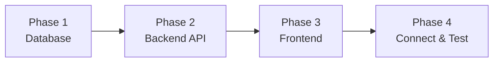
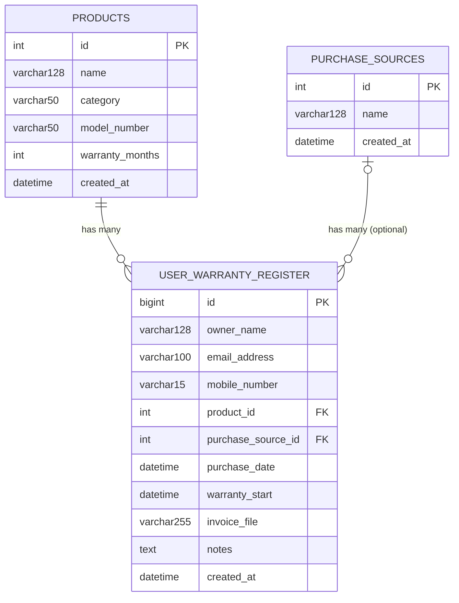

# Beginner's Build Guide
## Electronics Warranty Tracker — build it yourself, step by step

**Who this is for:** someone new to full-stack development, building this project alone for the first time.
**Read first (optional):** [Requirements_Guide.md](Requirements_Guide.md) explains *what* to build without telling you *how* — good for planning your own approach before following these steps.

---

## 1. What You're Building

**The problem:** people buy all kinds of electronics — solar panels, TVs, batteries, phones, appliances — and each one has a different warranty length. When something breaks, customers can't find the receipt, don't remember the purchase date, and don't know if it's still covered. That's frustrating for them and creates extra work for the company.

**The solution:** a simple website with two flows, and no login required:
1. **Register** — right after buying something, the customer fills out a short form and uploads a photo of their invoice.
2. **Check** — later, the customer types in their phone number and sees everything they've registered, with a clear "still covered / expiring soon / expired" status.

**What you're *not* building:** logins or accounts, an admin dashboard, or automatic repair/claim workflows. Keep the scope tight.

**One more thing before you start:** this app is meant to be run by **one company** for its own products — it's not a multi-company platform. But the product catalog (names, categories, warranty lengths) should live in your database as data, not be hardcoded in your code. That way, if a different company wanted to reuse this same app for their own products, they'd just clear the sample data and load their own — no code changes needed.

### 1.1 Prerequisites

You should be comfortable with:
- Basic C# (classes, properties)
- Basic JavaScript/TypeScript (functions, `async/await`)
- Basic SQL (tables, primary keys, foreign keys)

Install these tools first:
| Tool | Purpose |
|---|---|
| [.NET SDK 10](https://dotnet.microsoft.com/download) | runs the backend |
| [Node.js 20+](https://nodejs.org/) | runs the frontend build tools |
| MySQL Server (or [MySQL via Docker](https://hub.docker.com/_/mysql)) | the database |
| VS Code (with C# Dev Kit) or Visual Studio | code editor |
| Scalar UI (built into the project) or Postman | to test the API without a frontend |

### 1.2 Build Order

Build **bottom-up**: database → backend → frontend. Each part depends on the one before it, so you can test as you go instead of only at the very end.



| Phase | What you build | How you check it works |
|---|---|---|
| 1. Database | Tables + sample data | Run SQL queries directly in MySQL |
| 2. Backend | A REST API | Call endpoints with Scalar UI / curl — no frontend needed yet |
| 3. Frontend | Pages that call the API | Click through the app in a browser |
| 4. Integration | Both parts working together | Full end-to-end user journeys |

---

## 2. Phase 1 — Database

### 2.1 A Few Basics
- A **table** stores one kind of thing (a product, a registration).
- A **primary key** uniquely identifies each row — usually an auto-incrementing `id`.
- A **foreign key** points to another table's row, creating a relationship (e.g., "this registration is for this product").

### 2.2 The Schema

You need three tables:



### 2.3 Build the Products table

**Why it exists:** the customer needs to pick exactly what they bought, and the app needs to know its warranty length.

**Steps:**
1. Create a `products` table with the columns shown above.
2. `category` is just a text field — Solar Panel, Inverter, Battery, TV, Refrigerator, whatever fits your business. Don't hardcode a fixed list of categories anywhere in your code; just let them be values in the database.
3. `warranty_months` matters most — it's how long that specific product is covered. Put it on the product, not the category, since two products in the same category can have different warranty lengths (a cheap battery vs. a premium one, for example).
4. Add a handful of sample rows across a few categories so you'll have real data to test against.

**Check it:** `SELECT * FROM products;` should return your sample rows.

### 2.4 Build the Purchase Sources table

**Why it exists:** it's useful to know where a customer bought something, but they shouldn't be blocked from registering if they're not sure.

**Steps:**
1. Create a `purchase_sources` table: `id`, `name`, `created_at`.
2. Add a few sample rows (your store, an online marketplace, a dealer).
3. This table is **optional** from a registration's point of view — remember that when you design the foreign key later (it needs to allow empty/null).

**Check it:** `SELECT * FROM purchase_sources;`

### 2.5 Build the Warranty Registrations table

**Why it exists:** this is the actual record of "this customer bought this product on this date."

**Steps:**
1. Create `user_warranty_register` with the columns shown above.
2. `product_id` is required — every registration must point to a real product.
3. `purchase_source_id` is optional — allow it to be empty.
4. `mobile_number` isn't a foreign key, but it's the field customers will search by later, so treat it as important.
5. `invoice_file` just stores a file *path* (plain text) — the actual file will live on disk, not in the database (you'll build that in Phase 2).
6. On purpose, there's **no "warranty end date" or "status" column**. Those depend on today's date, so they'd go stale if you stored them. You'll calculate them instead, whenever they're needed (`warranty_start + product.warranty_months`).

**Check it:** manually insert one test registration pointing at a real product, then query it back with a join to `products` to confirm the relationship works.

### 2.6 Phase 1 Checklist
- [ ] `products` table created and seeded with a few categories
- [ ] `purchase_sources` table created and seeded
- [ ] `user_warranty_register` table created, with a required link to products and an optional link to purchase sources
- [ ] You can insert a registration and join it back to its product

---

## 3. Phase 2 — Backend API (ASP.NET Core)

### 3.1 A Few Basics
- A **Web API** is a set of URLs that return data (usually JSON) instead of full web pages.
- **EF Core** lets you write C# classes that map to database tables, so you can query with C# instead of raw SQL.
- A **Controller** groups related endpoints together — everything about products goes in `ProductsController`.
- A **DTO** is a plain class describing exactly what a request or response looks like.

### 3.2 Set Up the Project
1. Create a new ASP.NET Core Web API project.
2. Add NuGet packages: `Microsoft.EntityFrameworkCore` and `Pomelo.EntityFrameworkCore.MySql` (the MySQL driver for EF Core).
3. Put your MySQL connection string in `appsettings.json` under `ConnectionStrings:DefaultConnection`.
   > ⚠️ Don't commit a real password there. Use `dotnet user-secrets` locally, or an environment variable, right from the start — it's much harder to fix after the fact.
4. In `Program.cs`, register the database: `builder.Services.AddDbContext<AppDbContext>(...)`.
5. Optional but handy: add `Scalar.AspNetCore` for a free, browsable API test page at `/scalar/v1`, so you don't need Postman for quick checks.

### 3.3 Create Your Models
One C# class per table:

```csharp
public class Product
{
    public int Id { get; set; }
    public string Name { get; set; }
    public string Category { get; set; }
    public string? ModelNumber { get; set; }
    public int WarrantyMonths { get; set; }
    public DateTime CreatedAt { get; set; }

    public ICollection<UserWarrantyRegister> WarrantyRegistrations { get; set; }
}
```

Do the same for `PurchaseSource` and `UserWarrantyRegister` (the latter needs `ProductId`/`Product` and `PurchaseSourceId`/`PurchaseSource` fields, with `PurchaseSource` allowed to be empty). Use `[Table("products")]` / `[Column("name")]` attributes if your C# names differ from your SQL column names.

### 3.4 Create Your DbContext
A class inheriting `DbContext`, with one `DbSet<T>` per table. This is what EF Core uses to actually talk to the database.

**Check it:** run the app — if it starts without a connection error, you're wired up correctly.

### 3.5 Build: List Products

**Why it exists:** the registration form needs the product catalog to build its picker.

**Endpoint:** `GET /api/Products`

**Steps:**
1. Create `ProductsController`, injecting your `DbContext`.
2. Add a `GET` action returning all products as JSON.
3. Add `GET /api/Products/{id}` (single product, 404 if missing) and `GET /api/Products/search?name=...` (partial name match — useful for a searchable picker).

**Check it:** call `GET /api/Products` in Scalar UI and confirm you get your seeded products back.

### 3.6 Build: List Purchase Sources

**Why it exists:** an optional dropdown on the registration form.

**Endpoints:** `GET /api/PurchaseSources` and `GET /api/PurchaseSources/{id}` — same pattern as products, just simpler.

### 3.7 Build: Register a Warranty

This is the core feature and the trickiest one — build it piece by piece and test as you go.

**Endpoint:** `POST /api/WarrantyRegistrations` (accepts `multipart/form-data`, since it includes a file).

**Steps:**

1. **Define the request shape.** A DTO with: `OwnerName` (required), `EmailAddress` (optional, must look like an email), `MobileNumber` (required), `ProductId` (required), `PurchaseSourceId` (optional), `PurchaseDate` (required), `Notes` (optional), `InvoiceFile` (optional file).

2. **Check the product exists.** Look it up by `ProductId`; if it's not found, return a `400` with a clear message. Never assume the frontend only ever sends valid data.

3. **Check the purchase source exists** — only if one was given, since it's optional.

4. **Check the purchase date.**
   - Reject dates in the future.
   - Reject dates too far in the past — pick a window (e.g., 60 days) and document why.

5. **Check for duplicates.** If a registration already exists with the same phone number + product + purchase date + purchase source, reject it with a `409 Conflict`.

6. **Handle the file, if one was uploaded.**
   - Only allow certain extensions (`.pdf`, `.jpg`, `.jpeg`, `.png`) — reject anything else.
   - Only allow files up to a size limit (e.g., 2 MB) — reject anything bigger.
   - Generate your own random file name (like a GUID) — **never trust the uploaded file's name**, to avoid overwriting files or other issues.
   - Save the file to a folder on disk (e.g., `uploads/invoices/`), creating it if it doesn't exist.
   - Save only the file's relative path in the database — never the raw file bytes.

7. **Save the registration.** Set `WarrantyStart` equal to `PurchaseDate`, then save.

8. **Calculate the warranty end date.** `WarrantyEnd = WarrantyStart.AddMonths(product.WarrantyMonths)`. Calculate this fresh, every time — don't save it as a column.

9. **Return success (`201 Created`)** with the registration details, including the computed `WarrantyEnd`, so the frontend can immediately tell the customer "covered until [date]."

**Check it:** submit a real registration (with a test file) through Scalar UI or curl, and confirm:
- A row shows up in `user_warranty_register`
- A file shows up in `uploads/invoices/`
- The response includes the right `warrantyEnd` date
- Submitting the exact same data twice gets rejected the second time
- A purchase date too far in the past gets rejected

### 3.8 Build: List / Get a Registration

**Why it exists:** useful for support or your own testing — fetch one registration, or all of them, with the product's name already filled in.

**Endpoints:** `GET /api/WarrantyRegistrations` (all) and `GET /api/WarrantyRegistrations/{id}` (one). Use EF Core's `.Include()` to pull in the related `Product` and `PurchaseSource`, and shape the response to include the product's name and category directly — don't make the frontend ask twice just to show a name.

### 3.9 Build: Search by Mobile Number

**Why it exists:** this is how a returning customer checks their warranties — no login, just their phone number.

**Endpoint:** `GET /api/WarrantyRegistrations/mobile/{mobileNumber}`

**Steps:**
1. Return every registration matching that number.
2. If there are none, return a `404` — the frontend will treat that as "no results," not an error.
3. Same joined shape as Section 3.8.

> ⚠️ **Worth thinking about:** a phone number isn't secret. Anyone who knows (or guesses) someone's number could pull up their registrations and invoice through this endpoint. That's fine for a learning project, but write it down as a known limitation — a real product would probably add a one-time SMS code before showing results.

### 3.10 Phase 2 Checklist
- [ ] `GET /api/Products`, `GET /api/Products/{id}`, `GET /api/Products/search`
- [ ] `GET /api/PurchaseSources`, `GET /api/PurchaseSources/{id}`
- [ ] `POST /api/WarrantyRegistrations` with all validation rules working
- [ ] File upload saves to disk and the path is stored in the database
- [ ] `GET /api/WarrantyRegistrations`, `GET /api/WarrantyRegistrations/{id}`
- [ ] `GET /api/WarrantyRegistrations/mobile/{mobileNumber}`
- [ ] You tested every endpoint manually **before** touching the frontend

---

## 4. Phase 3 — Frontend (React + TypeScript + Vite)

### 4.1 A Few Basics
- A **SPA** (Single Page Application) loads once, then swaps content without full page reloads.
- **Components** are reusable pieces of UI.
- **Routing** maps a URL path to which page/component is shown.
- **Client-side validation** gives instant feedback, but never replaces backend checks — someone could always skip the frontend entirely.

### 4.2 Set Up the Project
1. Scaffold a Vite + React + TypeScript project.
2. Add: `react-router-dom` (routing), `react-hook-form` + `zod` + `@hookform/resolvers` (forms + validation), `tailwindcss` (styling), `lucide-react` (icons).
3. Set up Vite's dev proxy so `/api/*` calls forward to your backend — this lets the frontend use relative URLs instead of hardcoding a port, which matters once both are deployed together.
4. Set up folders: `pages/`, `components/`, `services/`, `types/`, `utils/`.

### 4.3 Define Your Types
Write TypeScript interfaces matching your API responses before building any UI:

```typescript
export interface Product {
  id: number;
  name: string;
  category: string;
  modelNumber: string;
  warrantyMonths: number;
}

export type WarrantyStatus = 'ACTIVE' | 'EXPIRING_SOON' | 'EXPIRED';
```

Do the same for `PurchaseSource`, the registration request, and the results shape.

### 4.4 Build a Simple API Layer
A small `apiFetch` wrapper around `fetch()` that adds the `/api` prefix, parses JSON, and throws a clear error on failure. Then a `warrantyService.ts` with one function per backend call (`getProducts()`, `getPurchaseSources()`, `registerWarranty()`, `searchWarrantyByMobile()`). Keep all API calls here — page components shouldn't call `fetch` directly.

### 4.5 Set Up Routing

| Path | Page | Section |
|---|---|---|
| `/` | `HomePage` | §4.6 |
| `/register` | `RegisterWarrantyPage` | §4.7 |
| `/register-success/:registrationId` | `RegistrationSuccessPage` | §4.8 |
| `/search` | `SearchWarrantyPage` | §4.9 |
| `/results` | `WarrantyResultsPage` | §4.10 |
| `*` | redirect to `/` | fallback |

### 4.6 Build: Home Page

**Why it exists:** a first-time visitor needs to instantly understand the site and see how to get started.

**Build:** a navbar, a short explanation of what the site does, and two clear buttons linking to `/register` and `/search`.

### 4.7 Build: Registration Form

**Why it exists:** this is where the customer actually registers a product.

**Steps:**
1. Build the form with `react-hook-form`, matching the backend fields exactly: owner name, mobile number, email (optional), product (a real picker, grouped by category — fetched from `GET /api/Products`), purchase source (optional dropdown, fetched from `GET /api/PurchaseSources`), purchase date, notes (optional), invoice file (optional).
2. Write a `zod` schema mirroring the backend rules (required fields, phone number format, email format, file size/type) — this gives instant feedback before hitting the server.
3. On submit, build a `FormData` object (needed for the file) and call your `registerWarranty()` function.
4. Show the backend's error messages clearly if something's rejected — never a generic "something went wrong."
5. On success, go to `/register-success/{id}`.

**Check it:** submit a valid registration, confirm it saved; then submit the same one again and confirm you see a clear duplicate error.

### 4.8 Build: Confirmation Page

**Why it exists:** confirms success and gives the customer a next step.

**Build:** read `registrationId` from the URL, show a success message, and add buttons to search warranties or register another product.

### 4.9 Build: Search Form

**Why it exists:** the simplest possible way for a returning customer to check their warranties.

**Build:** one field (mobile number, same format check as the registration form) that navigates to `/results?mobile={number}` on submit.

### 4.10 Build: Results Page

**Why it exists:** shows the customer everything they've registered, with clear status.

**Steps:**
1. Read the `mobile` query parameter.
2. Call `GET /api/WarrantyRegistrations/mobile/{mobile}`. Treat a `404` as "no results," not an error.
3. Fetch the product list too, so you know each registration's `warrantyMonths` (the registrations endpoint doesn't return a computed end date — see §3.8).
4. For each registration, calculate:
   - `warrantyEndDate = warrantyStartDate + product.warrantyMonths` (write this as one shared function, and be careful with month-end edge cases, like adding a month to Jan 31)
   - `status`: `EXPIRED` if the end date has passed, `EXPIRING_SOON` if 30 or fewer days remain, otherwise `ACTIVE`.
5. Show each registration as a card: product name/category, purchase date, warranty end date, a colored status badge, and a link to the invoice if one was uploaded.

**Check it:** register three test products with purchase dates chosen so one is clearly active, one is close to expiring, and one is already expired — confirm all three badges look right.

### 4.11 Phase 3 Checklist
- [ ] All 5 routes work
- [ ] Home page links to both flows
- [ ] Registration form validates on the frontend *and* shows backend errors clearly
- [ ] File upload works end-to-end
- [ ] Search → Results works, including the "no results" case
- [ ] Status badges compute correctly, including edge cases

---

## 5. Phase 4 — Connect Everything & Test

### 5.1 Wire It Together
1. Confirm the Vite dev proxy forwards `/api/*` to your backend, so you can run both at once during development without CORS problems.
2. For a real deployment, have the backend serve the frontend's built files directly, so it's all one deployable app on one URL.

### 5.2 Walk Through Real Use Cases
Don't call a feature "done" until you've tried it like a real user would:

| # | Use case | How to test it |
|---|---|---|
| 1 | New customer registers a product | Home → Register → fill form + upload invoice → submit → see success page |
| 2 | Customer checks an active warranty | Home → Search → enter mobile number → see "Active" badge |
| 3 | Customer checks a warranty expiring soon | Register with a purchase date so under 30 days remain → search → confirm "Expiring Soon" |
| 4 | Customer with nothing registered searches | Search an unused number → confirm a friendly empty message, not an error |
| 5 | Duplicate registration attempt | Submit the same registration twice → confirm the second one is clearly rejected |
| 6 | Bad purchase date | Try a future date and one too far in the past → confirm both are rejected with clear messages |
| 7 | Bad file upload | Try an unsupported file type and an oversized file → confirm both are rejected |

### 5.3 Common Mistakes to Avoid
- **Skipping backend checks because "the frontend already checks it."** Anyone can call your API directly and skip the frontend — always validate on the backend too.
- **Saving computed values.** Don't store a warranty end date — recalculate it from `warranty_start + warranty_months` every time.
- **Hardcoding categories or business details in your code.** Keep the catalog as data in the database, so it can be swapped out without touching code.
- **Committing secrets.** Never push real database passwords into `appsettings.json` or `.env` files.
- **Trusting uploaded file names.** Always generate your own file name.
- **Mixing up "no results" with "an error."** Decide up front which one your API returns, and make sure the frontend handles it as a normal case, not a crash.

---

## 6. Feature Summary

| Feature | Why it exists | Backend | Frontend |
|---|---|---|---|
| Browse products | Customer picks what they bought | `GET /api/Products`, `/search` | Product picker on Register page |
| Browse purchase sources | Customer optionally notes where they bought it | `GET /api/PurchaseSources` | Dropdown on Register page |
| Register a warranty | Customer records a purchase + proof | `POST /api/WarrantyRegistrations` | Register page |
| View one registration | Support/debugging | `GET /api/WarrantyRegistrations/{id}` | (not shown in the UI) |
| View all registrations | Support/debugging | `GET /api/WarrantyRegistrations` | (not shown in the UI) |
| Search by mobile number | Customer checks their own warranty status | `GET /api/WarrantyRegistrations/mobile/{number}` | Search + Results pages |
| Warranty status | Customer sees Active/Expiring/Expired at a glance | end date calculated in the response | recalculated again in Results page |

---

## 7. Glossary

| Term | Plain meaning |
|---|---|
| API endpoint | A specific URL your frontend calls to get or send data |
| DTO | A plain class describing exactly what a request or response looks like |
| ORM | A library (EF Core) that lets you use C# objects instead of raw SQL |
| Foreign key | A column that links one table's row to another table's row |
| SPA | Single Page Application — a frontend that swaps views without full reloads |
| Multipart form data | The request format used when a form includes a file upload |
| 400 / 404 / 409 | HTTP codes meaning "bad request," "not found," and "conflict" |

---

*Build one phase at a time, test it before moving on, and you'll always have something working — not just at the very end.*
