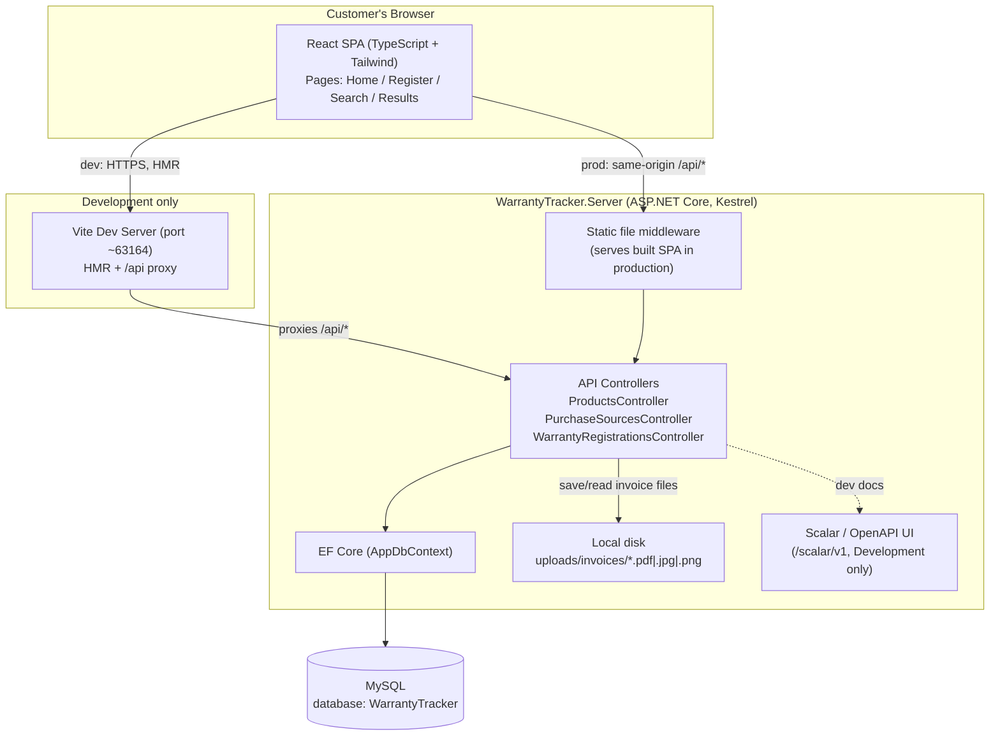
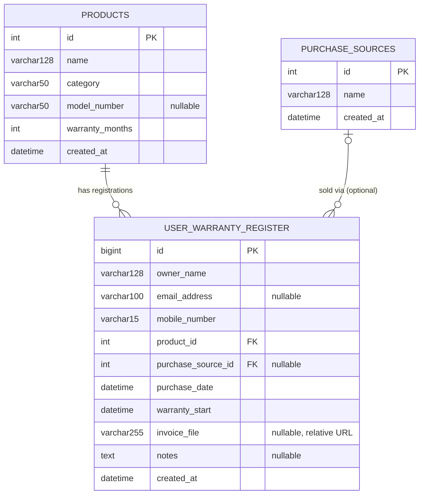

# Software Requirements Specification
## WarrantyTracker — JP Solar Warranty Registration Portal

**Version:** 1.0
**Date:** 2026-07-27
**Status:** Reverse-engineered from the current codebase (commit `5f5091c`, "Refactor: migrate to solar product-centric model for JP Solar")

> ⚠️ **Scope mismatch, flagged 2026-07-27:** the target product is a **general electronics warranty tracker** covering many product categories (solar equipment, TVs, batteries, appliances, and more), run by one company for its own catalog — not scoped to solar products only. The codebase this document describes has been narrowed to one company's brand identity ("JP Solar") and solar-only categories via the `revamp_solar_products.sql` migration. Treat everything below as documentation of *this one implementation*, not as the intended requirements. See [Requirements_Guide.md](Requirements_Guide.md) for the general requirements and [Beginner_Build_Guide.md](Beginner_Build_Guide.md) for a build path covering any product category. Reconciling the code to the general model (generalizing categories/seed data, removing JP-Solar-specific copy) is out of scope for this pass — docs only, per explicit decision.

---

## 1. Introduction

### 1.1 Purpose
WarrantyTracker is a public-facing web portal for **JP Solar**, a solar equipment company, that lets customers:
1. Register the warranty for a solar product they purchased (solar panels, inverters, batteries, charge controllers/mounting hardware), and
2. Look up the warranty status of previously registered products using their mobile number.

This document specifies the current implementation's architecture, data model, API contract, features, and non-functional characteristics, and flags gaps that should be resolved before a production launch.

### 1.2 Scope
The system is a single-tenant, single-company (JP Solar) application. It is **not** a multi-brand or multi-tenant device tracker — an earlier design iteration ("Device"/multi-brand) was refactored out in favor of a fixed JP Solar product catalog (see `WarrantyTracker.Server/Data/revamp_solar_products.sql`).

In scope:
- Customer self-service warranty registration (with invoice upload)
- Customer self-service warranty lookup by mobile number
- A fixed, seeded catalog of products and purchase sources

Out of scope (not implemented today — see [Section 9, Known Gaps](#9-known-gaps--risks)):
- Admin/back-office UI for managing products, purchase sources, or registrations
- Authentication/authorization of any kind
- Email/SMS notifications or expiry reminders
- Editing or deleting a registration once submitted

### 1.3 Definitions
| Term | Meaning |
|---|---|
| Product | An item in JP Solar's fixed catalog (panel, inverter, battery, charge controller/mounting) with a predefined warranty length in months |
| Purchase Source | Where the customer bought the product (JP Solar store, dealer, Amazon, Flipkart, etc.) |
| Registration | A customer's warranty claim record linking owner info + product + purchase details + optional invoice file |
| Warranty Start | Currently always equal to the purchase date |
| Warranty End | `WarrantyStart + Product.WarrantyMonths`, computed on the fly (never stored) |

---

## 2. Tech Stack

| Layer | Technology | Version |
|---|---|---|
| Backend framework | ASP.NET Core Web API | .NET 10.0 |
| ORM | Entity Framework Core | 9.0.0 |
| Database driver | Pomelo.EntityFrameworkCore.MySql | 9.0.0 |
| Database | MySQL | (local dev: port 3307) |
| API docs (dev only) | Scalar.AspNetCore (OpenAPI UI) | 2.14.14 |
| Dev SPA integration | Microsoft.AspNetCore.SpaProxy | 10.0.0-preview |
| Frontend framework | React | 19.2.6 |
| Frontend language | TypeScript | 6.0.2 |
| Build tool | Vite | 8.0.12 |
| Routing | React Router DOM | 7.17.0 |
| Forms & validation | React Hook Form + Zod | 7.77.0 / 4.4.3 |
| Styling | Tailwind CSS | 4.3.0 |
| Icons | lucide-react | 1.17.0 |
| HTTP client | native `fetch` (custom `apiFetch` wrapper) | — |
| State management | React local state only (no Redux/Zustand) | — |

No authentication library, no background job/scheduler, and no cloud storage SDK are referenced anywhere in the solution.

---

## 3. System Architecture



**Key architectural notes**
- The frontend and backend ship as **one deployable unit**: in production, ASP.NET Core serves the built React app as static files (`app.UseDefaultFiles()`, `app.MapFallbackToFile("/index.html")` in [`Program.cs`](../WarrantyTracker.Server/Program.cs)) and the SPA calls the same-origin `/api/*` routes.
- In development, Vite runs standalone and proxies `/api/*` to the ASP.NET backend (`vite.config.ts`), giving hot-module-reload for the frontend while reusing the real backend.
- There is no separate API gateway, cache layer, message queue, or background worker — it's a classic 3-tier monolith (SPA → Web API → RDBMS) plus local-disk file storage.
- Uploaded invoice files are stored directly on the web server's filesystem (`ContentRootPath/uploads/invoices/`), not in a database BLOB or object store — this couples file storage to a single server instance (see [Non-Functional Requirements](#8-non-functional-requirements)).

---

## 4. Database Schema

MySQL, code-first mapping via EF Core data annotations (no `Migrations/` history committed — schema changes are applied via hand-written SQL scripts, e.g. `revamp_solar_products.sql`).



### 4.1 Table details

**`products`** — fixed JP Solar catalog, seeded via SQL (12 rows across 4 categories: Solar Panel, Inverter, Battery, Charge Controller & Mounting). Warranty length is per-product, ranging 36–300 months (3–25 years).

**`purchase_sources`** — seeded lookup: JP Solar Company Store, JP Solar Authorized Dealer, JP Solar Online Store, Amazon, Flipkart, Local Solar Retail Shop.

**`user_warranty_register`** — one row per warranty registration. Owner identity (`owner_name`, `email_address`, `mobile_number`) is stored **denormalized on each row** — there is no separate `customers` table, so one person registering multiple products creates multiple independent owner records rather than one customer linked to many registrations.

**Notable omission:** there is no `warranty_end` or `status` column. Warranty end date and ACTIVE/EXPIRING_SOON/EXPIRED status are computed at request time, not persisted — see [Section 6.4](#64-warranty-lifecycle-logic).

---

## 5. Backend API Reference

Base route: `/api/[controller]`. **No authentication is required or enforced on any endpoint.** All responses are JSON except where noted.

### 5.1 Products

#### `GET /api/Products`
List the full product catalog.

**Response 200**
```json
[
  {
    "id": 1,
    "name": "Monocrystalline Solar Panel 450W",
    "category": "Solar Panel",
    "modelNumber": "SP-MONO-450",
    "warrantyMonths": 300
  },
  {
    "id": 4,
    "name": "Hybrid Solar Inverter 5kW",
    "category": "Inverter",
    "modelNumber": "INV-HYB-5K",
    "warrantyMonths": 60
  }
]
```

#### `GET /api/Products/{id}`
**Response 200** — single product object (same shape as above). **404** if not found.

#### `GET /api/Products/search?name={text}`
Substring match on product name. **400** if `name` is missing/blank.

**Response 200**
```json
[
  { "id": 1, "name": "Monocrystalline Solar Panel 450W", "category": "Solar Panel", "modelNumber": "SP-MONO-450", "warrantyMonths": 300 }
]
```

### 5.2 Purchase Sources

#### `GET /api/PurchaseSources`
```json
[
  { "id": 1, "name": "JP Solar Company Store" },
  { "id": 4, "name": "Amazon" }
]
```

#### `GET /api/PurchaseSources/{id}`
Single object, same shape. **404** if not found.

### 5.3 Warranty Registrations

#### `GET /api/WarrantyRegistrations`
All registrations, joined with product and purchase source.

**Response 200**
```json
[
  {
    "id": 17,
    "ownerName": "Ravi Kumar",
    "emailAddress": "ravi.kumar@example.com",
    "mobileNumber": "9876543210",
    "productName": "Hybrid Solar Inverter 5kW",
    "category": "Inverter",
    "modelNumber": "INV-HYB-5K",
    "purchaseSource": "JP Solar Authorized Dealer",
    "purchaseDate": "2026-06-01T00:00:00",
    "warrantyStart": "2026-06-01T00:00:00",
    "invoiceFile": "/uploads/invoices/3f2a9c1e-....png",
    "notes": null
  }
]
```
> Note: this response does **not** include `warrantyEnd` or `status` — the frontend recomputes both client-side from `warrantyStart` + the product's `warrantyMonths` (fetched separately via `GET /api/Products`).

#### `GET /api/WarrantyRegistrations/{id}`
Single object, same shape as above. **404** if not found.

#### `GET /api/WarrantyRegistrations/mobile/{mobileNumber}`
Used by the "search my warranties" flow. **404** if the mobile number has no registrations (frontend maps this to an empty list rather than an error).

```
GET /api/WarrantyRegistrations/mobile/9876543210
```
**Response 200** — array of registration objects (same shape as `GET /api/WarrantyRegistrations`).

> ⚠️ **Security note:** knowing a mobile number is the *only* access control — there is no OTP or ownership verification, so anyone who knows (or guesses/enumerates) a customer's mobile number can retrieve their name, email, purchase history, and invoice file. See [Section 9](#9-known-gaps--risks).

#### `POST /api/WarrantyRegistrations`
Creates a new registration. **`Content-Type: multipart/form-data`.**

**Request fields**

| Field | Type | Required | Constraints |
|---|---|---|---|
| `OwnerName` | string | Yes | max 128 chars |
| `EmailAddress` | string | No | valid email format, max 100 chars |
| `MobileNumber` | string | Yes | max 15 chars |
| `ProductId` | int | Yes | must reference an existing product |
| `PurchaseSourceId` | int | No | must reference an existing purchase source if provided |
| `PurchaseDate` | date | Yes | cannot be in the future; must be within the last 60 days |
| `Notes` | string | No | free text |
| `InvoiceFile` | file | No | `.pdf`, `.jpg`, `.jpeg`, `.png` only; max 2 MB |

**Example request (curl)**
```bash
curl -X POST https://localhost:7045/api/WarrantyRegistrations \
  -F "OwnerName=Ravi Kumar" \
  -F "EmailAddress=ravi.kumar@example.com" \
  -F "MobileNumber=9876543210" \
  -F "ProductId=4" \
  -F "PurchaseSourceId=2" \
  -F "PurchaseDate=2026-06-01" \
  -F "Notes=Installed on rooftop, south-facing" \
  -F "InvoiceFile=@invoice.pdf;type=application/pdf"
```

**Response 201 Created**
```json
{
  "id": 18,
  "ownerName": "Ravi Kumar",
  "mobileNumber": "9876543210",
  "product": "Hybrid Solar Inverter 5kW",
  "category": "Inverter",
  "modelNumber": "INV-HYB-5K",
  "purchaseDate": "2026-06-01T00:00:00",
  "warrantyStart": "2026-06-01T00:00:00",
  "warrantyMonths": 60,
  "warrantyEnd": "2031-06-01T00:00:00",
  "invoiceFile": "/uploads/invoices/8b1d2e77-4f3a-4c9e-9a2b-6c1e2f3a4b5c.pdf",
  "message": "Warranty registered successfully."
}
```

**Error responses**

| Status | Condition | Body |
|---|---|---|
| 400 | Product doesn't exist | `{ "message": "Selected product does not exist." }` |
| 400 | Purchase source doesn't exist | `{ "message": "Selected purchase source does not exist." }` |
| 400 | Purchase date in the future | `{ "message": "Purchase date cannot be a future date." }` |
| 400 | Purchase date &gt; 60 days ago | `{ "message": "Warranty registration must be completed within 60 days of purchase." }` |
| 400 | Bad file extension | `{ "message": "Only PDF, JPG, JPEG and PNG files are allowed." }` |
| 400 | File &gt; 2 MB | `{ "message": "Maximum allowed file size is 2 MB." }` |
| 409 | Same mobile + product + purchase date + purchase source already registered | `{ "message": "This product is already registered for the given mobile number." }` |

There are **no PUT/DELETE endpoints** — registrations cannot be edited or removed via the API once created, and there is no admin CRUD surface for products or purchase sources (they are catalog data seeded directly in the database).

---

## 6. Functional Requirements / Features

### 6.1 Home page (`/`)
- Hero section introducing JP Solar's warranty portal
- Two primary action cards: "Register a Warranty" and "Search My Warranty"
- Features/benefits section, footer

### 6.2 Register Warranty (`/register`)
- Form fields: owner name, mobile number, email (optional), product (grouped dropdown by category with thumbnails), purchase source (optional), purchase date, notes (optional), invoice file upload (optional)
- Client-side validation via React Hook Form + Zod (mirrors backend rules: required fields, 10-digit mobile regex, file type/size)
- On submit, posts multipart form data to `POST /api/WarrantyRegistrations`
- Displays backend validation errors (bad date, duplicate registration, bad file) inline
- On success, redirects to `/register-success/:registrationId`

### 6.3 Registration Success (`/register-success/:registrationId`)
- Confirms the registration ID
- Offers next steps: search warranties, register another product

### 6.4 Search Warranty (`/search`)
- Single field: mobile number (10-digit validated)
- Submits to `/results?mobile={number}`

### 6.5 Warranty Results (`/results?mobile=...`)
- Calls `GET /api/WarrantyRegistrations/mobile/{mobileNumber}`
- For each registration, fetches the product catalog (`GET /api/Products`) to resolve `warrantyMonths`, then computes:
  - **Warranty end date** = purchase date + product's warranty months (calendar-safe month arithmetic, clamped to last valid day of month)
  - **Status**: `EXPIRED` (end date passed), `EXPIRING_SOON` (≤30 days remaining), or `ACTIVE` (otherwise)
- Renders each registration as a card with a colored status badge, product details, purchase info, and a link to the uploaded invoice (if any)
- Empty state shown if the mobile number has no registrations

### 6.4 Warranty lifecycle logic
| Event | Rule |
|---|---|
| Registration window | Must register within 60 days of the purchase date; purchase date cannot be in the future |
| Duplicate prevention | Same mobile number + product + purchase date + purchase source cannot be registered twice |
| Warranty start | Always equals the purchase date (no separate installation/activation date) |
| Warranty end | `warrantyStart + product.warrantyMonths`, computed on read, not stored |
| Status thresholds | ACTIVE (&gt; 30 days remaining) / EXPIRING_SOON (≤ 30 days remaining) / EXPIRED (past end date) — computed **frontend-only** |

> ⚠️ The backend (`DateTime.AddMonths`) and frontend (custom calendar-safe function) use different month-arithmetic implementations. They can disagree on month-end edge cases (e.g., Jan 31 + 1 month) — worth reconciling into one shared implementation.

---

## 7. Frontend Structure

| Route | Component | Purpose |
|---|---|---|
| `/` | `HomePage` | Landing page |
| `/register` | `RegisterWarrantyPage` | Warranty registration form |
| `/register-success/:registrationId` | `RegistrationSuccessPage` | Post-submit confirmation |
| `/search` | `SearchWarrantyPage` | Mobile number lookup form |
| `/results?mobile=` | `WarrantyResultsPage` | List of registered warranties + status |
| `*` | — | Redirects to `/` |

State management is local component state only (`useState`/`useEffect`); no global store. API access goes through `services/api.ts` (fetch wrapper) and `services/warrantyService.ts` (typed calls + client-side warranty math).

---

## 8. Non-Functional Requirements

### 8.1 Performance
- **Current state:** all list endpoints (`GET /api/Products`, `GET /api/WarrantyRegistrations`, etc.) return the full table with no pagination, filtering, sorting, or caching — acceptable at the current seed-data scale (12 products, a handful of registrations) but will not scale as registrations grow into the thousands.
- **Recommendations for production:**
  - Add pagination (`skip`/`take` or cursor-based) to `GET /api/WarrantyRegistrations` before registration volume grows.
  - Add a database index on `user_warranty_register.mobile_number` (the only lookup key used by customers) if not already implicitly indexed as part of the schema.
  - Cache the largely-static `products` and `purchase_sources` catalogs on the frontend (they rarely change) to avoid refetching on every results-page render — `WarrantyResultsPage` currently fetches all products on every mobile-number search just to resolve `warrantyMonths`.
  - No response compression, output caching, or CDN configured for the API; static asset caching for the built SPA should be verified in the hosting environment.
- **Targets (recommended, not yet measured/enforced):** p95 API response time &lt; 300 ms for list/detail endpoints under normal load; file upload endpoint should handle the 2 MB max within a few seconds on typical connections.

### 8.2 Security
Current implementation has significant gaps relative to a production-ready warranty portal handling PII:

| Area | Current state | Risk / Recommendation |
|---|---|---|
| Authentication | None anywhere in the app | Any client can call any endpoint directly |
| Authorization on lookup | Mobile number is the only "credential" for `GET /api/WarrantyRegistrations/mobile/{number}` | Anyone who knows/guesses a customer's mobile number can view their name, email, purchase history, and invoice document. **Recommend adding OTP verification (SMS) before returning results**, or at minimum rate-limiting this endpoint. |
| Secrets management | MySQL password committed in plaintext in `appsettings.json` | Move to User Secrets (dev) / environment variables or a secrets manager (production); rotate the exposed credential |
| File upload validation | Extension allow-list + 2 MB size cap only; no content-type/magic-byte verification, no antivirus scanning | A malicious file renamed to `.png` could be uploaded; recommend validating actual file signatures and/or scanning uploads |
| File storage location | `uploads/invoices/` under the server's `ContentRootPath`, not excluded via `.gitignore` | Risk of customer-uploaded documents being committed to source control; also ties storage to a single server instance (no horizontal scaling of the API tier without shared/networked storage or migration to blob storage) |
| Transport security | `UseHttpsRedirection()` enabled | Ensure HTTPS is enforced end-to-end in production (reverse proxy/load balancer config) |
| Input validation | Present via DataAnnotations + Zod on the frontend | Server-side validation exists for the fields it covers; no rate limiting or anti-automation (CAPTCHA) on the public registration/search forms, which could be abused for enumeration or spam submissions |
| CORS | Not explicitly configured (same-origin deployment assumed) | Confirm no permissive CORS policy is added later without review |
| Authorization framework scaffold | `app.UseAuthorization()` is called but no authentication scheme or policies are registered | Currently a no-op; either wire up real auth or remove the misleading scaffold |

### 8.3 Reliability & Availability
- No automated tests (unit/integration) were found in the repository — regressions could ship silently. Recommend adding backend unit tests around the registration business rules (60-day window, duplicate detection) and frontend tests around the warranty-status calculation.
- No health-check endpoint, no structured logging/monitoring/alerting beyond default ASP.NET Core console logging.
- Single point of failure: one database, one file storage location, no redundancy configuration observed (deployment-environment concern, not purely code).

### 8.4 Usability & Accessibility
- Responsive, Tailwind-based UI with clear two-path navigation (register vs. search) from the home page.
- Form validation messages are shown inline (React Hook Form + Zod).
- Accessibility (ARIA labeling, keyboard navigation, color-contrast of status badges) was not verified in this review and should be audited before launch.

### 8.5 Maintainability
- Clean separation of concerns (Controllers/Models/Dto on backend; pages/components/services/types on frontend).
- No stored `warranty_end`/`status` means two independent date-math implementations (backend & frontend) must be kept in sync manually — a shared library or persisted computed column would reduce drift risk.
- No formal database migration history (schema changes applied via ad hoc SQL scripts) — recommend adopting EF Core Migrations for repeatable, versioned schema changes.

### 8.6 Data retention & compliance
- Customer PII (name, mobile, email, purchase history, invoice documents) is collected with no stated retention policy, consent notice, or deletion mechanism — worth addressing if this is customer-facing in a jurisdiction with data-protection requirements.

---

## 9. Known Gaps / Risks

These were identified during codebase review and should be explicitly triaged (accept, defer, or schedule) rather than left implicit:

1. **No authentication anywhere** — public write (`POST`) and read-by-mobile-number endpoints are open to anyone.
2. **Mobile-number-only lookup** is not real access control; a customer's registered products/invoices can be retrieved by anyone who has (or guesses) their number.
3. **Plaintext DB credentials** committed to `appsettings.json`.
4. **Uploaded invoice files** live on local disk, not gitignored, and not backed by durable/replicated storage.
5. **No notification/reminder system** despite collecting email addresses — "expiring soon" status is only visible if the customer manually searches.
6. **No persisted warranty end date/status** — computed redundantly in two places (backend response, frontend render) with two different date-math implementations.
7. **No admin interface** — the product/purchase-source catalog can only be changed via direct SQL.
8. **No edit/delete** of a submitted registration (e.g., to correct a typo in owner name or fix an invoice upload).
9. **No automated tests** in the repository.
10. Legacy `specs/` files in the frontend (`warrantytracker.client/specs/`) describe an earlier multi-brand "Device" design and are out of date relative to the current single-company JP Solar model — retain only as historical context, not as current requirements.

---

## 10. Appendix: Seeded Catalog Data

**Products** (from `WarrantyTracker.Server/Data/revamp_solar_products.sql`)

| Name | Category | Model # | Warranty |
|---|---|---|---|
| Monocrystalline Solar Panel 450W | Solar Panel | SP-MONO-450 | 300 mo (25 yr) |
| Polycrystalline Solar Panel 330W | Solar Panel | SP-POLY-330 | 240 mo (20 yr) |
| Bifacial Solar Panel 550W | Solar Panel | SP-BIFA-550 | 300 mo (25 yr) |
| Hybrid Solar Inverter 5kW | Inverter | INV-HYB-5K | 60 mo (5 yr) |
| On-Grid Solar Inverter 3kW | Inverter | INV-ONG-3K | 60 mo (5 yr) |
| Off-Grid Solar Inverter 8kW | Inverter | INV-OFG-8K | 60 mo (5 yr) |
| Lithium Solar Battery 5kWh | Battery | BAT-LI-5K | 120 mo (10 yr) |
| Lead-Acid Solar Battery 150Ah | Battery | BAT-PB-150 | 36 mo (3 yr) |
| Tubular Solar Battery 200Ah | Battery | BAT-TUB-200 | 48 mo (4 yr) |
| MPPT Charge Controller 60A | Charge Controller & Mounting | CC-MPPT-60 | 60 mo (5 yr) |
| PWM Charge Controller 30A | Charge Controller & Mounting | CC-PWM-30 | 36 mo (3 yr) |
| Solar Panel Roof Mounting Kit | Charge Controller & Mounting | MNT-ROOF-KIT | 120 mo (10 yr) |

**Purchase Sources**: JP Solar Company Store, JP Solar Authorized Dealer, JP Solar Online Store, Amazon, Flipkart, Local Solar Retail Shop.

---

*This document was generated by reviewing the current state of the repository (backend controllers/models, frontend pages/services/types, SQL migration scripts, and configuration files) rather than from a pre-existing spec, since no up-to-date SRS previously existed for the project.*
